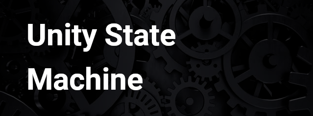

Simple and effective State Machine behaviour implementation for Unity, including Transitable states.

# Installation

Add package from GIT url: https://github.com/domenkoneski/unity-state-machine.git

# Documentation

## 1. State Behaviour

To start using a `StateMachine` create a new component class which extends from the `StateBehaviour`. `StateBehaviour` has a StateMachine built in and extends the standard `MonoBehaviour`.

Other Unity related methods are available for you to use, such as `OnEnable()`, `OnAwake()`, etc. The only exceptions are `Fixed()` and `Late()`, more about it in *1.1. StateBehaviour Fixed and Late update callbacks*

```csharp
public class SimpleStateBehaviour : StateBehaviour {
    public override void OnStart() {
        // Same as Start()
    }

    public override void OnUpdate() {
        // Same as Update()
    }
}
```

Now you have an access to the `StateMachine` instance which is initialized for you. Minimalistic example:

```csharp
public class SimpleStateBehaviour : StateBehaviour {

    public override void OnStart() {
        this.StateMachine.AddState(new StateFirst("MyFirstState"));
        this.StateMachine.SetStartState("MyFirstState");
    }

    public override void OnUpdate() { }
}
```

### 1.1. StateBehaviour Fixed and Late update callbacks

If you need `Fixed()` and `Late()` update callbacks simply implement `StateBehaviour.IStateBehaviourFixedUpdate` and/or `StateBehaviour.IStateBehaviourLateUpdate` interfaces and the StateBehaviour will automatically propagate Fixed and Late updates. These Unity methods are reserved by StateMachine for internal updates.

```csharp
public class SimpleStateBehaviour : StateBehaviour, StateBehaviour.IStateBehaviourFixedUpdate {

    public void OnFixedUpdate() {
        // On Fixed Update will be called
    }

    public override void OnStart() {
        // Same as Start()
    }

    public override void OnUpdate() {
        // Same as Update()
    }
}
```

## 2. State class

To create your custom state extend the abstract `State` class. State can receive:

- `OnStateEnter()`, called only once, right before this state is being active in the StateMachine, 
- `OnStateExit()`, called only once, right before another state is active in the StateMachine and 
- `OnStateUpdate()`, called each frame while the state is active.

A dummy example:

```csharp
public class MyState : State {

    public MyState(string stateTag) : base(stateTag) { }

    public override void OnStateEnter() {
        // Initialize or prepare something here.
    }

    public override void OnStateExit() {
        // Destruct, flush memory, reset anything if needed.
    }

    public override void OnStateUpdate() {
        // Called each frame
    }  
}
```

If you need a physics update or late update callbacks implement `IStateLateUpdate` or `IStateFixedUpdate` interfaces, e.g.:

```csharp
public class MyStateWithFixedUpdate : State, IStateFixedUpdate {

    ... State impl ...

    public void OnStateFixedUpdate() {
        // Called each fixed frame
    }  
}
```

### 2.1. TransitableState class

There is also an extended type of a state which can be used for state transitions that are not instant - you want to gradually change to a new state. For this purposes `TransitableState` is made. `TransitableState` has two additional methods apart from the ones from `State`:

- `OnStateEnterTransition(float t)`,
- `OnStateExitTransition(float t)`

Where `t` is a normalized value `[0 - 1]` which represents `elapsedTransitionTime / transitionDuration`. `0` means transition has started, `1` means transition has ended (entered / exited).

## 3. StateTransition

To switch between States you need to add a `StateTransition` which represents a starting/entry state, ending/exit state, transition duration (0 or instantly by default) and a trigger tag. For an example lets create a `StateTransition` between two `States` and trigger/switch from the starting state (`StateFirst`) to the second state by pressing `button A`. The state transition will be instant.

```csharp
public class ExampleStateBehaviour : StateBehaviour {

    public override void OnStart() {
        StateMachine.AddState(new StateFirst("StateFirst"));
        StateMachine.AddState(new StateSecond("StateSecond"));
        
        StateMachine.AddTransition("StateFirst", "StateSecond", triggerName: "MyTriggerName");

        StateMachine.SetStartState("StateFirst");
    }

    public override void OnUpdate() {
        if (Input.GetKeyDown(KeyCode.A)) {
            StateMachine.Trigger("MyTriggerName");
        }
    }
}
```

Explanation: The StateMachine will start using `StateFirst` as a starting state, `OnStateUpdate()` will be called each frame on `StateFirst`. As soon as the user presses `button A` the state transition will occour. `OnStateExit()` will be called on `StateFirst` then `OnStateEnter()` will be called on `StateSecond` and `OnStateUpdate()` will be called each frame on `StateSecond`.

### 3.1. StateTransition duration

`StateTransition` can have a duration which can be used in conjuction with `TransitableStates` so you can get callbacks to `OnStateEnterTransition(float t)` and `OnStateExitTransition(float t)`.

Full example:

```csharp
public class ExampleStateBehaviour : StateBehaviour {

    public override void OnStart() {
        StateMachine.AddState(new StateFirst("StateFirst"));
        StateMachine.AddState(new StateSecond("StateSecond"));
        
        // Transition duration is in seconds 1f = 1s.
        StateMachine.AddTransition("StateFirst", "StateSecond", triggerName: "MyTriggerName", transitionDuration: 5f);

        StateMachine.SetStartState("StateFirst");
    }

    public override void OnUpdate() {
        if (Input.GetKeyDown(KeyCode.A)) {
            StateMachine.Trigger("MyTriggerName");
        }
    }
}

public class StateFirst : TransitableState {

    public StateFirst(string stateTag) : base(stateTag) { }

    public override void OnStateEnter() {
        Debug.Log($"[{this.GetType().Name}] Enter.");
    }

    public override void OnStateEnterTransition(float t) {
        Debug.Log($"[{this.GetType().Name}] EnterTransition {t}.");
    }

    public override void OnStateExit() {
        Debug.Log($"[{this.GetType().Name}] Exit.");
    }

    public override void OnStateExitTransition(float t) {
        Debug.Log($"[{this.GetType().Name}] ExitTransition {t}.");
    }

    public override void OnStateUpdate() {
        Debug.Log($"[{this.GetType().Name}] Update.");
    }
}

public class StateSecond : TransitableState {

    public StateSecond(string stateTag) : base(stateTag) { }

    public override void OnStateEnter() {
        Debug.Log($"[{this.GetType().Name}] Enter.");
    }

    public override void OnStateEnterTransition(float t) {
        Debug.Log($"[{this.GetType().Name}] EnterTransition {t}.");
    }

    public override void OnStateExit() {
        Debug.Log($"[{this.GetType().Name}] Exit.");
    }

    public override void OnStateExitTransition(float t) {
        Debug.Log($"[{this.GetType().Name}] ExitTransition {t}.");
    }

    public override void OnStateUpdate() {
        Debug.Log($"[{this.GetType().Name}] Update.");
    }
}
```

The transition will be 5s long and you can retrieve normalized value `[0 - 1]` to get the progress of transition.

## 4. Other

### 4.1. StateMachine context

You can get `StateMachine` context in implemented `State` or `TransitableState` classes so you can trigger any `StateTransitions` within the `State` itself.

```csharp
public class StateSecond : State {

    public StateSecond(string stateTag) : base(stateTag) { }

    public override void OnStateEnter() {
        this.StateMachine.Trigger("MyTrigger");
    }
}
```
